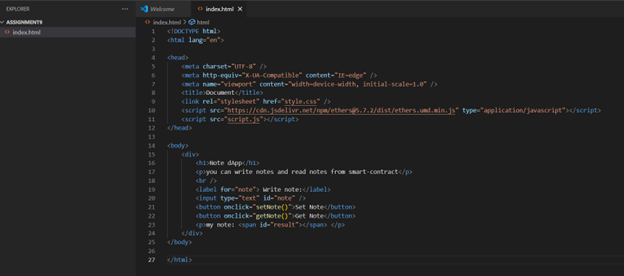
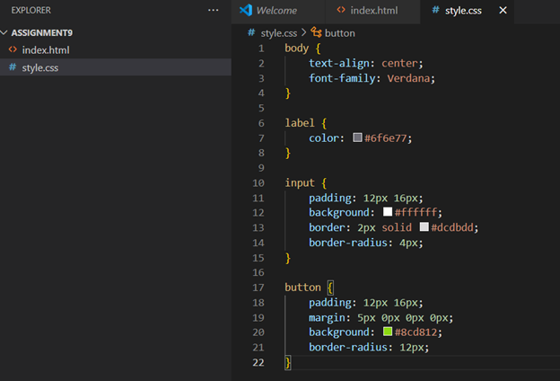
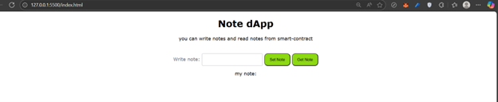
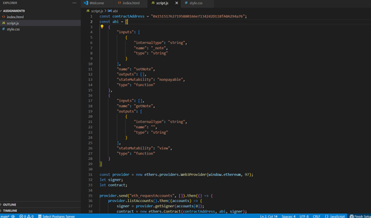
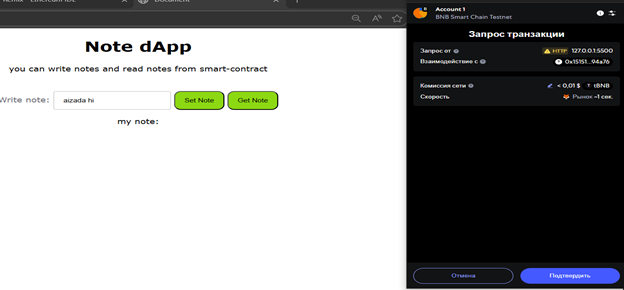
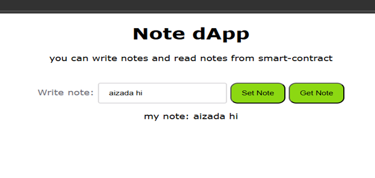

# Assignment 9 

## **Part 1: Creating a Smart Contract**

1. Created new file Note.sol in remix:


## Artifacts:

- Address: 0x151517627195880166e7134242D118fA0A294a76
- ABI:

```json
[
	{
		"inputs": [
			{
				"internalType": "string",
				"name": "_note",
				"type": "string"
			}
		],
		"name": "setNote",
		"outputs": [],
		"stateMutability": "nonpayable",
		"type": "function"
	},
	{
		"inputs": [],
		"name": "getNote",
		"outputs": [
			{
				"internalType": "string",
				"name": "",
				"type": "string"
			}
		],
		"stateMutability": "view",
		"type": "function"
	}
]
```

## **Part 2. Creating a basic web page**

1. Created new file with name index.html and include additional code in our exist index.html:



2. Also created style.css file with several styles:



3. Using live serve I open index.html in browser:







## ** Added script to connect web3 wallet and interact with smart contract using ui smart: **


